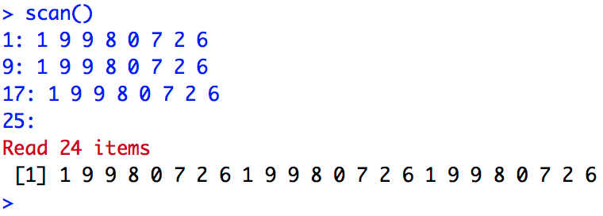

```{r setup, include=FALSE}
knitr::opts_chunk$set(echo = TRUE, comment = NA)
```

# Vectors

## Data types in R

A ** vector ** is an ordered sequence of data. `R` has many types of data, for example:

- `logical`: logical (``` TRUE``` or ```FALSE```)
- `integer`: whole numbers, $\ mathbb Z$
- `numeric`: real numbers, $\ mathbb R$
- `complex`: complex numbers, $\ mathbb C$
- `character`: words

In the vectors of `R`, all their objects must be of the same type: all numbers, all words, etc. When we want to use vectors formed by objects of different types, we will have to use ** generalized lists **, `lists' that we will see at the end of the topic.

## Basic

- ```c ()```: to define a vector
- ```scan ()```: to define a vector
- ```fix (x)```: to visually modify the vector $x$
- ```rep (a, n)```: to define a constant vector that contains the data $a$ repeated $n$ times

```{r example_rep}
c(1,2,3)
rep("Tono",5)
```


## Función scan() {.example}

This functions also work with URL with text files

**Example**

This is an example of how to create a vector that contains 3 copies of 1 9 9 8 0 7 2 6 with the scan function:
<div class = "aligncenter">

</div>

## Progressions and Sequences

An arithmetic progression is a succession of numbers such that the **difference**, $d$, of any pair of successive terms in the sequence is constant.
$$a_n = a_1 + (n-1) \ cdot d$$

- ```seq (a, b, by=d)```: to generate an [arithmetic progression](https://es.wikipedia.org/wiki/ArhythmicProgression) of difference $d$ that starts in $to$ up get to $b$
- ```seq (a, b, length.out=n)```: define arithmetic progression of length $n$ ranging from $a$ to $b$ with difference $d$. Therefore $d = (b-a) / (n-1)$
- ```seq (a, by= d, length.out=n)```: define the arithmetic progression of length $n$ and difference $d$ starting in $a$
- ```a:b```: define the sequence of consecutive numbers ** ($\ mathbb {Z}$) between two numbers $a$ and $b$