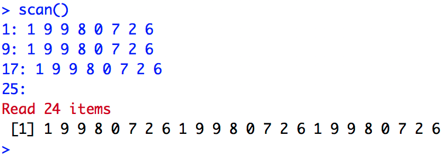

```{r setup, include=FALSE}
knitr::opts_chunk$set(echo = TRUE, comment = NA)
```

# Vectors

## Data types in R

A **vector** is an ordered sequence of data. `R` has many types of data, for example:

- `logical`: logical (``` TRUE``` or ```FALSE```)
- `integer`: whole numbers, $\mathbb Z$
- `numeric`: real numbers, $\mathbb R$
- `complex`: complex numbers, $\mathbb C$
- `character`: words

In the vectors of `R`, all their objects must be of the same type: all numbers, all words, etc. When we want to use vectors formed by objects of different types, we will have to use **generalized lists**, 'lists' that we will see at the end of the topic.

## Basic

- ```c()```: to define a vector
- ```scan()```: to define a vector
- ```fix(x)```: to visually modify the vector $x$
- ```rep(a, n)```: to define a constant vector that contains the data $a$ repeated $n$ times

```{r example_rep}
c(1,2,3)
rep("Tono",5)
```


## scan() function 

This functions also work with URL with text files

**Example**

This is an example of how to create a vector that contains 3 copies of 1 9 9 8 0 7 2 6 with the scan function:
<div class = "aligncenter">

</div>

## Progressions and Sequences

An arithmetic progression is a succession of numbers such that the **difference**, $d$, of any pair of successive terms in the sequence is constant.
$$a_n = a_1 + (n-1) \ cdot d$$

- ```seq (a, b, by=d)```: to generate an [arithmetic progression](https://es.wikipedia.org/wiki/ArhythmicProgression) of difference $d$ that starts in $to$ up get to $b$
- ```seq (a, b, length.out=n)```: define arithmetic progression of length $n$ ranging from $a$ to $b$ with difference $d$. Therefore $d = (b-a) / (n-1)$
- ```seq (a, by= d, length.out=n)```: define the arithmetic progression of length $n$ and difference $d$ starting in $a$
- ```a:b```: define the sequence of consecutive numbers ** ($\mathbb{Z}$) between two numbers $a$ and $b$

## Example of sequence 

* This is an example of a sequence `r seq(5, 60, by = 3.5)`
* If we want a sequence of **n** lengh we can use `r seq(5, 60, length.out = 7)`
* If we want to start in n number and have a determinate lenght with n step we use `r seq(5, length.out = 7, by = 3)`

## Sequences Exercises

- Numbers sequence from 1 ot 20:  `r 1:20`
- First 20 pair numbers: `r seq(2,by=2, length.out=20)`
- 30 equidistant numbers bettwen 17 and 98 with 4 significative decimals: 
```{r sequence_round, echo=FALSE, results='asis'} 
seqX = seq(17,98, length.out=30)
signif(seqX , digits = 6)
```

## Example of vector 

This is another example to generate a vector, c is also named as concatenation:

```{r concatenation, echo=TRUE}
c(rep(pi, 5), 5:10, -7) -> x
x
c(0, x, 10, x, 20)
```

## Functions

When we want to apply a function to each of the elements of a data vector, the `sapply` function saves us having to program with loops in `R`:

- ''sapply (vector_name, FUN = function_name)'': to apply this function to all vector elements
- ```sqrt(x)```: Calculate a new vector with the square roots of each of the elements of the vector $x$

## Example of use sapply function 

```{r sapply_function_other_topology, echo=TRUE}
x <- 1:10
sapply(x, FUN = function(w){sqrt(w)})
```

```{r sapply_other_topology, echo=TRUE}
sapply(x, function(w)sqrt(w))
```

## Functions

Given a vector of data $x$ we can calculate many statistical measures about it:

- ```length(x)```: Calculate the length of the vector $x$
- ```max(x)```: calculates the maximum of the vector $x$
- ```min(x)```: Calculate the minimum of the vector $x$
- ```sum(x)```: calculates the sum of the entries of the vector $x$
- ```prod(x)```: Calculate the product of the vector entries $x$

## Functions

- ```mean(x)```: calculates the arithmetic mean of the entries in the vector $x$
- ```diff(x)```: calculates the vector formed by the successive differences between entries of the original vector $x$
- ```cumsum(x)```: calculates the vector formed by the cumulative sums of the original vector entries $x$
  - Allows to define sequences described by summation
  - Each entry of ``cumsum(x)`` is the sum of the $x$ entries up to its position
  
## Functions

```{r functions_example}
square_fun = function(x){x^2}
v = c(1,2,3,4,5,6)
sapply(v, FUN = square_fun)
mean(v)
cumsum(v)
```

## Order

- ```sort(x)```: order the vector in natural order of the objects that form it: the increasing numerical order, alphabetical order ...
- ```rev(x)```: invert the order of the vector elements $x$

```{r order_example}
v = c(1,7,5,2,4,6,3)
sort(v)
rev(v)
```

## Order Exercises

```{r order_exercise_one, results='asis'}
v = c(1,7,5,2,4,6,3)
s = sort(v)
rev(s)
```

```{r order_exercise_one_shorter, results='asis'}
v = c(1,7,5,2,4,6,3)
sort(v, decreasing = TRUE)
```

```{r order_exercise_two, results='asis'}
v = c(1,7,5,2,4,6,3)
s = rev(v)
sort(s)
```

## Subvectors

- ```vector[i]```: gives the $i$ -th entry of the vector

  - R indexes start at 1
  - ```vector[length(vector)]```: gives us the last entry of the vector
  - ```vector[a:b]```: if $a$ and $b$ are two natural numbers, the subvector gives us with the entries of the original vector that go from the $to$-th position until the $b$-th.
  - ```vector [-i]```: if $i$ is a number, this subvector is made up of all the entries of the original vector except the $i$ -th entry. If $i$ turns out to be a vector, then it is an index vector and creates a new vector with the entries of the original vector, whose indexes belong to $i$
  - ```vector[-x]```: if $x$ is a vector (of indices), then this is the complement of vector [$x$]
  
## Subvectors

- Also has logic operators:
	
	- ```==```: =
	- ```!=```: $\neq$
	- ```>=```: $\ge$  
	- ```<=```: $\le$
	- ```<```: $<$
	- ```>```: $>$
	- ```!```: NO logic
	- ```&```: AND logic
	- ```|```: OR logic
	
## Subvectors

```{r}
v = c(14,5,6,19,32,0,8)
v[2]
v[-c(3,5)]
v[v != 19 & v>15]
```

## Subvectors

```{r}
w = seq(3, 50, by = 3.5) 
w
w[4:8]
w[8:4]
w[seq(2, length(w), by = 2)]
```

## Subvectors

```{r}
w[seq(1, length(w), by = 2)]
w[-seq(2, length(w), by = 2)]
w[(length(w)-2):length(w)]
w[c(1,5,6)]
```

## Subvectors

```{r}
w[w>30]
w[w>20 & w<40]
w[w!=3 & w!=17]
w[w<10|w>40]
```
## Subvectors

```{r}
w[w>=10]
w[w>10]
w[!w<10]
w[w%%2==0]
w[w%%2==1]
w>30
```

## Subvectors

```{r}
w[w%%2==1]
w>30
```

## Subvectors

If we evaluate one vector in another vector, this will evaluate the position that meet the condition, also just can be possible if the two vectors has the same length 

```{r, results='hold'}
x = c(1,7,4,2,4,8,9,2,0)
y = c(5,2,-3,-7,-1,4,-2,7,1)
x
y>0
x[y>0]
```